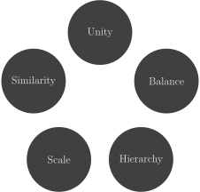
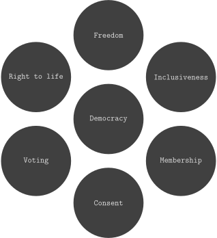

<!--
SPDX-FileCopyrightText: 2021-2 Galagic Limited, et al. <https://galagic.com>

SPDX-License-Identifier: CC-BY-SA-4.0

figular generates visualisations from flexible, reusable parts

For full copyright information see the AUTHORS file at the top-level
directory of this distribution or at
[AUTHORS](https://gitlab.com/thegalagic/figular/AUTHORS.md)

This work is licensed under the Creative Commons Attribution 4.0 International
License. You should have received a copy of the license along with this work.
If not, visit http://creativecommons.org/licenses/by/4.0/ or send a letter to
Creative Commons, PO Box 1866, Mountain View, CA 94042, USA.
-->

# Concept/Circle

A circle of concepts with (optionally) one in the centre. It can be rotated
and the font changed. You can try it on our website
[here](https://figular.com/tryit/concept/circle/).

* [Suggested Purpose](#suggested-purpose)
* [Usage](#usage)
* [Limitations](#limitations)
* [Examples](#examples)

## Suggested Purpose

* A circular flow of ideas, concepts or workflow.
* A collection of concepts of equal weight
* A central concept with multiple contributing/ancillary concepts

## Usage

### On the Website

Here's what you should see when you first visit the
[Circle](https://figular.com/tryit/concept/circle/) page:


Under 'Data' there is a text box where you enter a list of concepts, one per
line that will be included in the figure. They will be drawn in sequence
starting from the top.

Below that in the 'Styling' section you can alter various style settings. The
settings are in groups which can be collapsed by clicking the shrink icon
in their header. There are two groups:

* Figure: these affect how the figure draws its data.
  * Rotation: the degree from which to start drawing the circles. Zero degrees
    is midnight and we draw clockwise.
  * Centralise: whether to draw the first circle in the middle.
* Circle: these affect how each individual circle that makes up the figure are
  drawn.
  * Background color: background of each circle.
  * Border color: the color of the border. Note the border will not be visible
    unless it has a width bigger than 0.
  * Border style: the style in which to draw the border: solid, dotted, dashed,
    longdashed, dashdotted, longdashdotted.
  * Border width: size or thickness of the border.
* Text Box: these affect how the text in each circle is drawn.
  * Color: color of the text.
  * Font size: size of the text/font, in points.
  * Font: the family or typeface to use for the text.
  * Font Weight: how heavy is the font, either normal or bold.

See [Figular#styling](../../Figular.md#styling) for more detail on styling primitives.

Finally you can hit the download button to get your image. By default this will
be in [PNG](https://en.wikipedia.org/wiki/Portable_Network_Graphics) format but
you can change this to
[SVG](https://en.wikipedia.org/wiki/Scalable_Vector_Graphics) with the toggles
underneath the download button.

### At the Cmdline

The `fig` command expects your data in the second arg (after the figure name)
and any optional style as a JSON doc in the third arg. An example in BASH:

```bash
fig concept/circle "$(cat << EOF
Democracy
Freedom
Inclusiveness
Membership
Consent
Voting
Right to life
EOF
)" '{ "figure_concept_circle": {  "middle": true }, "textbox": { "font_family": "Computer Modern Teletype" } }'
```

The data should contain at least one line. Each line is put into a circle and
they are drawn in sequence from the top (midnight) then around in clockwise
direction.

The optional JSON styling allows a number of settings, all optional. An example
of what can be styled at the figure level looks like this:

```bash
fig concept/circle "$(cat << EOF
Democracy
Freedom
Inclusiveness
Membership
Consent
Voting
Right to life
EOF
)" "$(cat << EOF
{
  "figure_concept_circle": {
    "middle": true,
    "rotation": 0
  }
}
EOF
)"
```

Here's a description of the various parameters:

|Name|Type|Default|Description|
|----|----|-------|-----------|
|middle|Bool|False|Put the first circle in the centre of the other circles.|
|rotation|Integer|0|Start drawing outer circles offset from midnight by a number of degrees|

You can also style the primitive circles and text boxes of which the figure is
composed, e.g.

```bash
fig concept/circle "$(cat << EOF
Democracy
Freedom
Inclusiveness
Membership
Consent
Voting
Right to life
EOF
)" "$(cat << EOF
{
  "figure_concept_circle": {
    "middle": true,
    "rotation": 0
  },
  "circle": {
    "background_color": "white",
    "border_color": "red",
    "border_width": 3,
    "border_style": "dashed"
  },
  "textbox": {
    "color": "lightblue",
    "font_family": "Helvetica",
    "font_size": 24
  }
}
EOF
)"
```

Note that for the purpose of styling text boxes appear as the children of their
circles in the document object model, i.e. "circle > textbox".

See [Figular#styling](../../Figular.md#styling) for more on styling.

## Limitations

* Each concept/blob is visualised as a single line of text. Long lines cause big
  circles, this makes the text appear smaller and harder to read. It's best to
  stick to short lines for now.
* Website only: we accept up to 5000 characters of data for now, so big lists
  of concepts will return an error. Let us know if this is a problem for you as
  we can adjust this.

## Examples



[Elements of the design of the art (wikipedia.org)](https://en.wikipedia.org/wiki/Visual_design_elements_and_principles#Elements_of_the_design_of_the_art)

### On the Website

Ensure 'centralise: first item' is **not** ticked then enter the following into
the text box:

```text
Unity
Balance
Hierarchy
Scale
Similarity
```

### At the Cmdline

```bash
fig concept/circle "$(cat << EOF
Unity 
Balance
Hierarchy 
Scale 
Similarity
EOF
)"
```

---



[The cornerstones of Democracy (wikipedia.org)](https://en.wikipedia.org/wiki/Democracy)

### On the Website

Ensure 'centralise: first item' is ticked then enter the following into the text
box:

```text
Democracy
Freedom
Inclusiveness
Membership
Consent
Voting
Right to life
```

### At the Cmdline

```bash
fig concept/circle "$(cat << EOF
Democracy
Freedom
Inclusiveness
Membership
Consent
Voting
Right to life
EOF
)" "$(cat << EOF
{
  "figure_concept_circle": {
    "middle": "true"
  },
  "circle": {
    "font_family": "Computer Modern Teletype"
  }
}
EOF
)"
```
