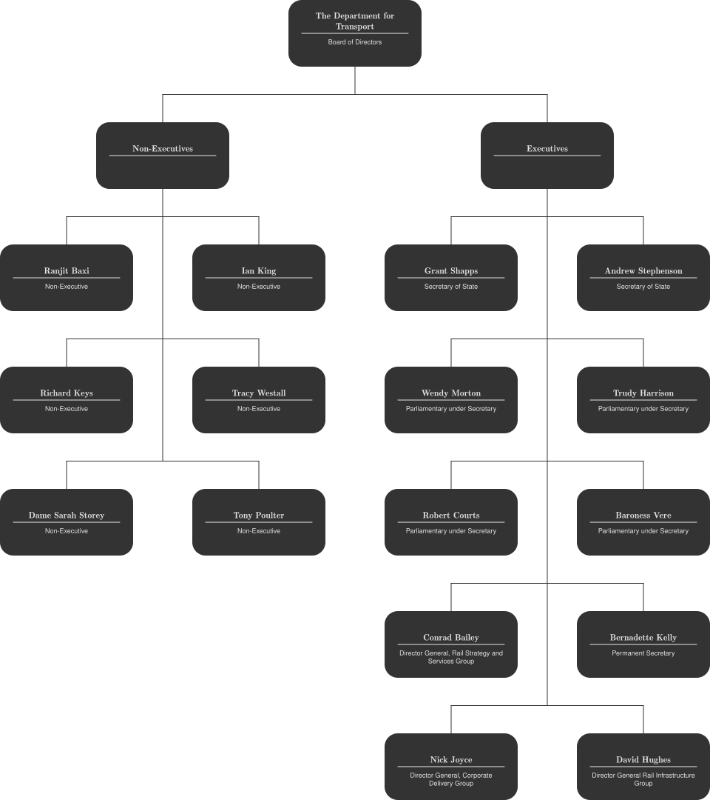

<!--
SPDX-FileCopyrightText: 2021-2 Galagic Limited, et al. <https://galagic.com>

SPDX-License-Identifier: CC-BY-SA-4.0

figular generates visualisations from flexible, reusable parts

For full copyright information see the AUTHORS file at the top-level
directory of this distribution or at
[AUTHORS](https://gitlab.com/thegalagic/figular/AUTHORS.md)

This work is licensed under the Creative Commons Attribution 4.0 International
License. You should have received a copy of the license along with this work.
If not, visit http://creativecommons.org/licenses/by/4.0/ or send a letter to
Creative Commons, PO Box 1866, Mountain View, CA 94042, USA.
-->

# Org/OrgChart

An organisational chart used to show the structure of an organisation and the
relationships between the people/roles within in. You can try it on our website
[here](https://figular.com/tryit/org/orgchart/). It produces a tree diagram:


* [Suggested Purpose](#suggested-purpose)
* [Usage](#usage)
  * [Website Usage](#website-usage)
    * [Entering Data: Typing](#entering-data-typing)
    * [Entering Data: Spreadsheet](#entering-data-spreadsheet)
    * [Styling](#styling)
  * [Cmdline Usage](#cmdline-usage)
* [Limitations](#limitations)
* [Examples](#examples)

## Suggested Purpose

* To show the roles, responsibilities and management structure of an
  organisation.
* To represent any concepts or relationships that follow a tree-like structure.
  So long as the relationships always link from one thing to many things
  or in other words there are no overlaps. For example you cannot have a leaf
  on the tree that belongs to more than one branch.

## Usage

### Website Usage

Here's what you should see when you first visit the
[Org Chart](https://figular.com/tryit/org/orgchart/) page:


You can enter the data for your organisation in the text box, at the top left of
the page. There are two ways to do this: **typing** it in or from a
**spreadsheet**. We go into more details on this below, along with the various
ways to style the results.

Finally you can hit the download button to get your image. By default this will
be in [PNG](https://en.wikipedia.org/wiki/Portable_Network_Graphics) format but
you can change this to
[SVG](https://en.wikipedia.org/wiki/Scalable_Vector_Graphics) with the toggles
underneath the download button.

#### Entering Data: Typing

You need to enter lines to describe your organisation. Each line can state up to
three things:

* A name/role
* (Optionally) a description of the role
* (Optionally) the name/role they report to

Each field is separated by the pipe `|` character:

```text
Name/role|Description|Name/role they report to
```

So for example to add a CEO role with a description:

```text
CEO|Chief Executive Officer
```

Our CEO reports to no one, so that information is simply left off. To add their
first employee, a CTO, we add another line:

```text
CEO|Chief Executive Officer
CTO|Chief Technology Officer|CEO
```

The CTO reports to the CEO so we include that detail on the end of the CTO line.
Continuing in this way we can describe a whole organisation.

As stated above description and reporting are optional, as are the pipes. So the
following are all valid lines:

* `Name` - representing a person with no description and no boss.
* `Name|Description` - a person with a description and no boss.
* `Name|Description|` - a person with a description and no boss.
* `Name||Boss` - a person with no description and a boss.
* `Name|Description|Boss` - a person with a description and a boss.

See below for more [examples](#examples) of complete organisations.

#### Entering Data: Spreadsheet

It may be easier to manage your organisation in a spreadsheet. If you setup your
spreadsheet with the right columns you can easily copy/paste with Figular
to get your org chart. Here are the first three columns and rows of an example
spreadsheet:

|Role|Description|Reports To|
|----|-----------|----------|
|CEO |Chief Executive Officer||
|CTO |Chief Technology Officer|CEO|

You can have additional columns to the right, they will be ignored by Figular.
You can leave any cell blank as needed. Using this spreadsheet you can then
copy/paste directly into the text box on the Figular website.

Some notes:

* You can include the column headings in the data you paste, these will be
  ignored by Figular.
* Most spreadsheets will separate their fields with hard tabs when pasting,
  Figular will accept these. It may make editing difficult on the website as
  inserting a tab into a text box is a pain. Better to make all your edits in
  the spreadsheet.

#### Styling

In the 'Styling' section of the web page you can alter various style settings.
The settings are in groups which can be collapsed by clicking the shrink
icon in their header. There are four groups:

* Figure: these affect how the figure draws its data.
  * Wide Layout: if enabled the figure will only use one row for every team
    member, creating a wider layout than usual. If disabled then up to two team
    members are placed on each row and any that have their own teams are placed
    on a final row together. It is off by default.
  * Tight Layers: if enabled than deeper layers will be shuffled together where
    possible creating a narrower layout. If not enable then they are kept apart
    by the horizontal spacing. It is off by default.
  * Horizontal Spacing: the minimum space between roles in PostScript "big
    points" (1bp = 1/72 inch). It is 80 by default.
  * Vertical Spacing: the space between rows in PostScript "big points" (1bp =
    1/72 inch). It is 120 by default.
* Shape: these affect how the shape is drawn around each role.
  * Background color: background of each circle.
  * Border color: the color of the border. Note the border will not be visible
    unless it has a width bigger than 0.
  * Border style: the style in which to draw the border: solid, dotted, dashed,
    longdashed, dashdotted, longdashdotted.
  * Border width: size or thickness of the border.
* Titles: these affect how the title is drawn for each role (the top label).
  * Color: color of the text.
  * Font size: size of the text/font, in points.
  * Font: the family or typeface to use for the text.
  * Font Weight: how heavy is the font, either normal or bold.
* Subtitles: these affect how the subtitle is drawn for each role (the bottom label).
  * Color: color of the text.
  * Font size: size of the text/font, in points.
  * Font: the family or typeface to use for the text.
  * Font Weight: how heavy is the font, either normal or bold.

See [Figular#styling](../../Figular.md#styling) for more detail on styling primitives.

### Cmdline Usage

Similar to the website the `fig` command expects the orgchart expressed in
separate lines. Optional styling can be provided as a third argument:

```bash
fig org/orgchart "$(cat << EOF
The Great Company
Managing Director|Managing the direction|The Great Company
Head of Science|Heading the science|Managing Director
Scientist No 1||Head of Science
Scientist No 2||Head of Science
Head of Marketing|Heading the marketing|Managing Director
Marketeer No 1||Head of Marketing
Marketeer No 2||Head of Marketing
Head of Operations|Heading the operations|Managing Director
Operator No 1||Head of Operations
Operator No 2||Head of Operations
EOF
)" "$(cat << EOF
{
  "figure_org_orgchart": {
    "landscape": false,
    "tuck": false,
    "horizspacing": 25,
    "vertspacing": 80
  },
  "shape": {
    "background_color": "white",
    "border_color": "black",
    "border_width": 3,
    "line": {
      "border_color": "red",
      "border_width": 2
    }
  },
  "textbox": {
    "color": "black",
    "font_family": "Helvetica"
  }
}
EOF
)"
```

All other rules and limitations apply expect that you can specify as much data
as a single cmdline will allow. See below for more cmdline examples.

The figure has its own style settings as show above:

```JSON
"figure_org_orgchart": {
  "landscape": false,
  "tuck": false,
  "horizspacing": 25,
  "vertspacing": 80
}
```

These settings are identical to those described above in the 'Styling' section
and as available on the webpage however:

* Landscape refers to the "Wide Layout" setting, false by default.
* Tuck refers to the "Tight Layers" setting, false by default.

You can style the primitive shapes, lines and text boxes of which the figure is
composed. The document object model looks like this:

* Shapes (per person/role). It has these children:
  * Text box (the title) - 1st child
  * Line - 2nd child
  * Text box (the role) - 3rd chlid
* Lines (drawn between roles)

So if we want to style the lines inside each shape and not touch those between
the shapes we should use:

```JSON
{
  "shape": {
    "line": {
      "border_color": "red",
      "border_width": 2
    }
}
```

## Limitations

* A role can only belong to one team. In terms of the tree this means a leaf can
  only hang from one branch.
* Any roles with the same name will be treated as one role. So if you need two
  "Sales Managers" you will have to distinguish them somehow, e.g. "Sales
  Manager 1", "Sales Manager 2".
* We only draw one chart. The last person with no manager is positioned
  at the top as the 'root'. If your tree has more than one root you need to
  split up your data, run the figure multiple times and collate the results
  yourself.
* Website only: we accept up to 5000 characters of data for now, so big org
  charts will return an error. Let us know if this is a problem for you as we
  can adjust this.
* Names of people/roles must match exactly wherever they occur for the chart to
  draw correctly.

## Examples


### On the Website

Enter the following into the text box:

```text
The Great Company
Managing Director|Managing the direction|The Great Company
Head of Science|Heading the science|Managing Director
Scientist No 1||Head of Science
Scientist No 2||Head of Science
Head of Marketing|Heading the marketing|Managing Director
Marketeer No 1||Head of Marketing
Marketeer No 2||Head of Marketing
Head of Operations|Heading the operations|Managing Director
Operator No 1||Head of Operations
Operator No 2||Head of Operations
```

### At the Cmdline

```bash
fig org/orgchart "$(cat << EOF
The Great Company
Managing Director|Managing the direction|The Great Company
Head of Science|Heading the science|Managing Director
Scientist No 1||Head of Science
Scientist No 2||Head of Science
Head of Marketing|Heading the marketing|Managing Director
Marketeer No 1||Head of Marketing
Marketeer No 2||Head of Marketing
Head of Operations|Heading the operations|Managing Director
Operator No 1||Head of Operations
Operator No 2||Head of Operations
EOF
)"
```

---



This information is taken from that made publicly available by the UK
government: [DfT and transport NDPB organisational charts - GOV.UK](https://www.gov.uk/government/publications/department-for-transport-and-ndpb-structure-charts-organisational-and-salary-disclosure-data)

### On the Website

Enter the following into the text box (truncated due to website size limits):

```text
The Department for Transport|Board of Directors
Non-Executives||The Department for Transport
Executives||The Department for Transport
Grant Shapps|Secretary of State|Executives
Andrew Stephenson|Secretary of State|Executives
Wendy Morton|Parliamentary under Secretary|Executives
Trudy Harrison|Parliamentary under Secretary|Executives
Robert Courts|Parliamentary under Secretary|Executives
Baroness Vere|Parliamentary under Secretary|Executives
Conrad Bailey|Director General, Rail Strategy and Services Group|Executives
Bernadette Kelly|Permanent Secretary|Executives
Nick Joyce|Director General, Corporate Delivery Group|Executives
Ranjit Baxi|Non-Executive|Non-Executives
Ian King|Non-Executive|Non-Executives
Richard Keys|Non-Executive|Non-Executives
Tracy Westall|Non-Executive|Non-Executives
Dame Sarah Storey|Non-Executive|Non-Executives
Tony Poulter|Non-Executive|Non-Executives
David Hughes|Director General Rail Infrastructure Group|Executives
```

### At the Cmdline

```bash
fig org/orgchart "$(cat << EOF
The Department for Transport|Board of Directors
Non-Executives||The Department for Transport
Executives||The Department for Transport
Grant Shapps|Secretary of State|Executives
Andrew Stephenson|Secretary of State|Executives
Wendy Morton|Parliamentary under Secretary|Executives
Trudy Harrison|Parliamentary under Secretary|Executives
Robert Courts|Parliamentary under Secretary|Executives
Baroness Vere|Parliamentary under Secretary|Executives
Conrad Bailey|Director General, Rail Strategy and Services Group|Executives
Bernadette Kelly|Permanent Secretary|Executives
Nick Joyce|Director General, Corporate Delivery Group|Executives
Ranjit Baxi|Non-Executive|Non-Executives
Ian King|Non-Executive|Non-Executives
Richard Keys|Non-Executive|Non-Executives
Tracy Westall|Non-Executive|Non-Executives
Dame Sarah Storey|Non-Executive|Non-Executives
Tony Poulter|Non-Executive|Non-Executives
David Hughes|Director General Rail Infrastructure Group|Executives
EOF
)"
```
